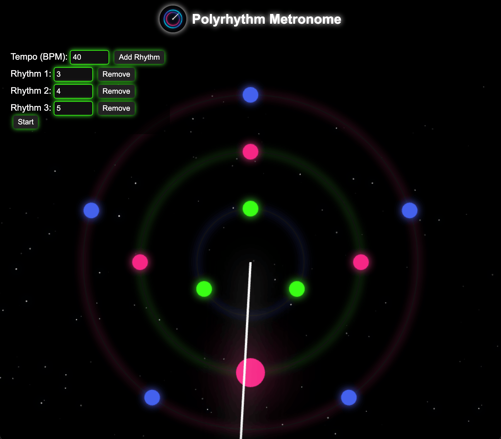

# Polyrhythm Metronome 🎵

A polyrhythm metronome built with Electron. Add, remove, or customize different polyrhythms
using the neon-themed clock interface with the beats showing up as circles on the orbit and 
synced audio.

<br>
<p align="center">
  
  
</p>
<br>

---

## Features

 - Clock style circular metronome with multiple orbits for different rhythms
 - Adjustable BPM and polyrhythms (i.e., 3:4, 2:3:8)
 - Visual pulses synchronized with beats
 - Distinct sounds for each rhythm

---

## Releases

Download the latest version from the [Releases Page](https://github.com/Karan5352/polyrhythm-metronome/releases):

| Platform   | File Type  |
|------------|------------|
|  macOS   | `.dmg`      | 
|  Windows | `.exe`      | 
|  Linux   | `.AppImage` | 

If youre on macOS - ARM and see this message:

“Polyrhythm Metronome is damaged and can’t be opened. You should move it to the Trash.”

This happens because the app is not yet signed or notarized by Apple.  
You can safely bypass this warning by running the following command in Terminal:

```bash
xattr -cr /Applications/Polyrhythm\ Metronome.app
```

---

## Manual Setup

#### 1. Clone the Repository

```bash
git clone https://github.com/Karan5352/polyrhythm-metronome.git
cd polyrhythm-metronome
```

#### 2. Install Dependencies

```bash
npm install
```

#### 3. Run the App in Development Mode

```bash
npm start
```

#### 4. (Optional) Create platiform specific installer

```bash
npm run dist
```
For Windows, run as Administrator.

---
